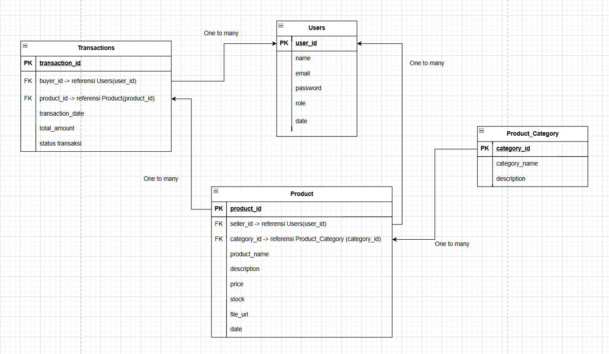

# 🛒 MINI PROJECT: DIGITAL MARKETPLACE SQL DATABASE

---

## 📖 DESKRIPSI PROYEK
Proyek ini merupakan bagian dari tugas **Full-Stack Web Development** dengan fokus pada pembuatan struktur database dan implementasi query SQL. Case study yang digunakan adalah **Marketplace Produk Digital** yang menghubungkan kreator (seller) dengan pembeli (buyer) untuk jual beli produk digital seperti e-book, template desain, source code, dan lainnya.

## 📋 STRUKTUR DATABASE
### Entitas Utama
| No | Nama Tabel          | Deskripsi                                  | Primary Key  | Foreign Key            |
|----|---------------------|--------------------------------------------|--------------|------------------------|
| 1  | Users               | Data pengguna (buyer, seller, admin)       | user_id      | -                      |
| 2  | Product_Category    | Kategori produk digital                    | category_id  | -                      |
| 3  | Product             | Data produk yang dijual                    | product_id   | seller_id, category_id |
| 4  | Transactions        | Data transaksi pembelian produk            | transaction_id | buyer_id, product_id |

### Diagram ERD

Berikut adalah link untuk mengakses diagram ERD dan dokumentasinya:
-**ERD Diagram (dbdiagram.io)**-:
https://dbdiagram.io/d/erd-digital-marketplace-69ac0d75a3f0aa31e122dfbe

-**Dokumentasi ERD (dbdocs)**-:
https://dbdocs.io/bahrul000000111/ERD-Digital-Marketplace?view=relationships

### Relasi Antar Tabel
- **Users ↔ Product**: 1-to-Many (Satu seller bisa jual banyak produk)
- **Product_Category ↔ Product**: 1-to-Many (Satu kategori bisa punya banyak produk)
- **Users ↔ Transactions**: 1-to-Many (Satu buyer bisa lakukan banyak transaksi)
- **Product ↔ Transactions**: 1-to-Many (Satu produk bisa dibeli dalam banyak transaksi)

## 🚀 CARA MENJALANKAN PROYEK
### Persyaratan
- MySQL Server 8.0+ atau MySQL Workbench
- Akses ke terminal atau Git Bash (untuk Github)

### Langkah Jalankan
1. **Buat Struktur Database**  
   Jalankan file `database/01-create-structure.sql` untuk membuat database dan tabel.

2. **Isi Data ke Tabel**  
   Jalankan file `database/02-insert-data.sql` untuk mengisi data contoh ke semua tabel.

3. **Jalankan Query**  
   Jalankan file-file di folder `queries/` sesuai kebutuhan:
   - `01-sql-fundamentals.sql`: Query dasar
   - `02-aggregate-conditional.sql`: Query agregat dan logika kondisional
   - `03-join-statements.sql`: Query dengan JOIN antar tabel

## 📊 HASIL QUERY
Semua hasil eksekusi query dapat dilihat di folder `assets/screenshots/` yang berisi gambar bukti eksekusi setiap bagian query dengan hasil yang sesuai.

## 🛠️ TOOLS YANG DIGUNAKAN
- **Database Management**: MySQL Workbench
- **ERD Design**: Draw.io
- **Version Control**: Github
- **Formatting**: SQL Formatter untuk menjaga kejelasan kode
